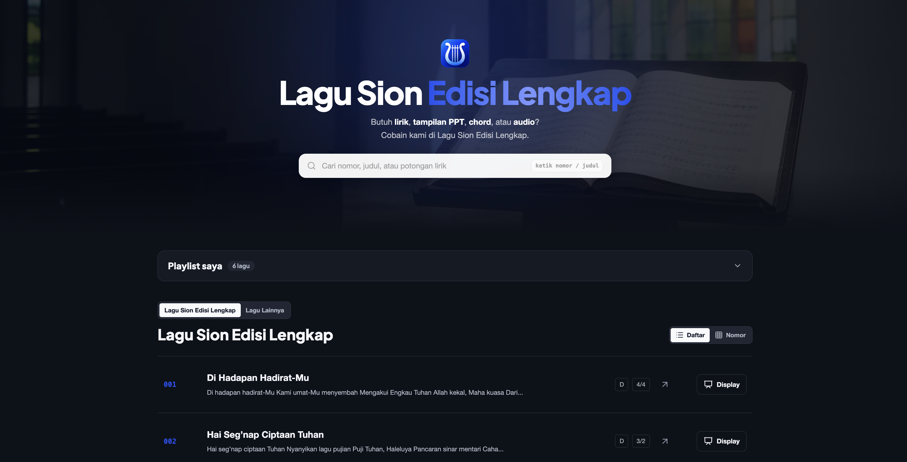

# Lagu Sion Edisi Lengkap



Katalog lirik dan chord Lagu Sion Edisi Lengkap berbasis Next.js dan MongoDB, dengan admin privat dan mode display satu bait per slide.

## Menjalankan lokal

```bash
cp .env.example .env.local
npm install
npm run dev
```

Buka `http://localhost:3000`. Area admin tersedia di `/admin`.

## Konfigurasi

- `MONGODB_URI`: koneksi MongoDB Atlas atau MongoDB lokal.
- `MONGODB_DB`: nama database, default `lagusion`.
- `ADMIN_PASSWORD`: password admin tunggal.
- `AUTH_SECRET`: secret panjang dan acak untuk menandatangani sesi.
- `NEXT_PUBLIC_SITE_URL`: domain production untuk canonical URL dan sitemap.
- `NEXT_PUBLIC_GA_ID`: ID Google Analytics 4 (`G-XXXXXXXXXX`). Kosongkan untuk mematikan tracking.
- `ADMIN_GATE`: string acak, path login admin jadi `/masuk/<ADMIN_GATE>`.

Tanpa `MONGODB_URI`, aplikasi menampilkan tiga lagu demo dalam mode baca-saja. Lirik dipisahkan menjadi slide berdasarkan baris kosong.

## Presenter dan layar kedua

Klik **Tampilkan slide** pada halaman lagu, lalu **Mulai presentasi**. Jendela utama menjadi remote; jendela tayangan dapat diletakkan di proyektor/monitor kedua. Gunakan mode **Extend**, bukan Mirror, pada pengaturan layar komputer. Chrome/Edge yang mendukung Window Management meminta izin untuk mengarahkan jendela ke layar kedua. Safari/browser lain: geser jendelanya manual. Klik **Layar penuh** di jendela tayangan; browser dapat mewajibkan klik ini.

Remote menyediakan next/previous, pilih bait, layar gelap, tema, pencarian lagu, dan pilihan lirik/chord. Pencarian menyiapkan lagu tanpa mengubah tayangan sampai **Tayangkan lagu ini** ditekan. Chord memakai font monospace dan ukuran slide menyesuaikan ruang. Lagu tanpa data chord tidak menyediakan pilihan chord.

Dua jendela pada browser yang sama tersinkron melalui BroadcastChannel tanpa Firebase. Refresh jendela tayangan meminta ulang keadaan terakhir; menutup remote mengakhiri sesi. Refresh remote memulai sesi baru melalui **Mulai presentasi**.

Untuk layar di perangkat lain, konfigurasi Firebase:

1. Buat web app dan Realtime Database di proyek Firebase, lalu aktifkan **Authentication → Anonymous**.
2. Isi lima variabel `NEXT_PUBLIC_FIREBASE_*` di `.env.local`/environment deployment dengan konfigurasi web app dan URL Realtime Database. Restart dev server atau rebuild setelah mengubahnya.
3. Pasang rules dari `firebase.database.rules.json` pada Realtime Database yang dipakai fitur ini. Gabungkan dengan rules yang sudah ada bila database dipakai aplikasi lain.
4. Mulai presentasi, tunggu status sinkronisasi online aktif, lalu **Salin link layar** dan buka di perangkat tayangan.

Rules membatasi penulisan ke pemilik sesi anonim. Pembaca harus terautentikasi dan mengetahui ID sesi acak dari link; daftar sesi tidak bisa dibaca. Link memberi akses tayangan (bukan kontrol) selama maksimal 12 jam. Sesi dihapus saat remote ditutup normal; koneksi terputus menandai sesi berhenti melalui `onDisconnect`. Rules kedaluwarsa menolak pembacaan, tetapi pembersihan data sesi yatim setelah browser crash dapat dilakukan melalui console/retention job. Jangan aktifkan rules publik global. Verifikasi rules di emulator/proyek staging sebelum deployment.

## Pemeriksaan

```bash
npm test
npm run lint
npm run build
```
